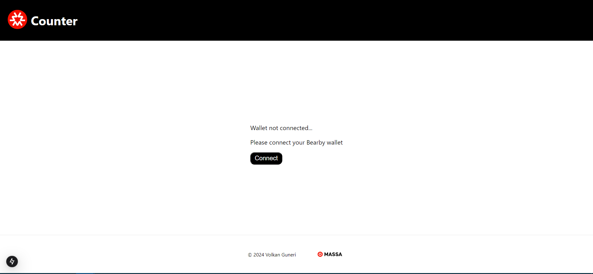
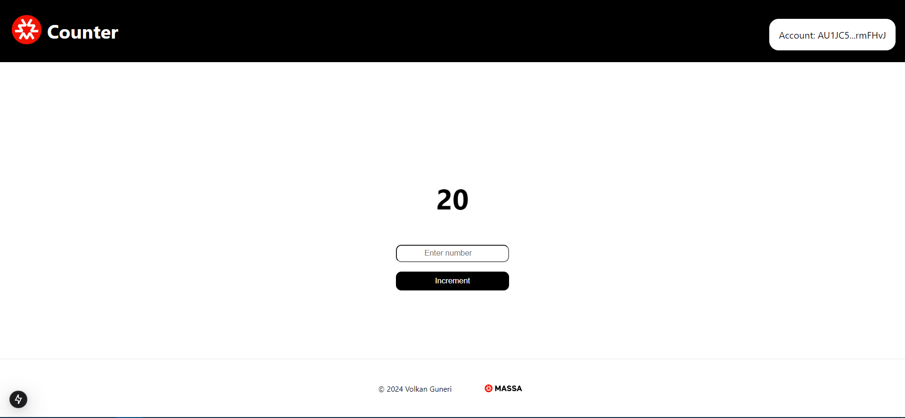

# 🎉 Counter DApp on the Massa Blockchain 

## ⚙️ Installation Guide

From the root of the project, simply run:

```shell
pnpm install
```
💡 Note: There's a workspace setup at the root, so this will install all dependencies for both backend and frontend simultaneously!

💡 Note: If you ever encounter an @as-pect file missing error, kindly install it by running:

```shell
pnpm instal -D @as-pect/assembly
```
## 🔨 Building the Backend

Navigate to the backend:

```shell
cd backend
```

Then, to build all files in the `assembly/contracts` directory, run: 

```shell
pnpm run build
```

## 🧪 Running Unit Tests

To test the smart contract, simply use:

```shell
pnpm run test
```

## 🚀 Deploying the Contract

1. Create a .env file in the backend folder with the following

```shell
  WALLET_SECRET_KEY=
```
🗝️ This key will be used by the deployer script to interact with the Massa blockchain.

✅ Ensure to use a Massa blockchain account whose private key starts with `S`.

👛 You can create an account on (["Bearby"](https://bearby.io/)) or (["Massa Wallet"](https://station.massa.net/)).

💡 Note: To connect to Counter on the frontend, you'll need to use Bearby, as Massa Wallet connection is not implemented yet.

2. To build the contracts in `assembly/contracts` and run the deployment script `src/deploy.ts`, which deploys to the node specified in the `.env` file:

```shell
pnpm run deploy
```
3. When deployment finishes, you’ll see the smart contract’s deployment address in the console. 

- Copy this address 
- Replace CONTRACT_ADDRESS with the deployed address in 

```shell
frontend/src/app/components/IncrementCounter.tsx
```

## 🖥️ User Interface 

To run the user interface, follow these steps:

1. Navigate to the frontend folder:

```shell
cd frontend
```
2. Start the Next.js server:

```shell
pnpm run dev
```

3. Access the app in your browser:

Go to: 

```shell
http://localhost:3000/
```
...or any other port displayed in your terminal.

💡 Note: If you have the Bearby wallet installed, a Connect button will appear.




🔗 Once connected, enjoy the DApp! 🎉



💡 Note: On your first connection, if the counter doesn't display correctly, just refresh the page! 

## 🤖 Server & Smart Contract Interactions with Go

To run the Go server to reset the counter, follow these steps:

1. Navigate to the Go folder:

```shell
cd backend/go
```
2. To ensure that Go is installed on your computer, run:

```shell
go version
```

If not, follow the documentation on [Install GO](https://go.dev/doc/install).

3. Once Go is installed, run the following commands:

```shell
go get
go run server.go
```


## Roadmap  ➡️
- To never store your secrets and private keys in plain text on your hard disk by using .env files, implement the Chainlink env-enc module to encrypt your secrets before storing them, or use any other encryption procedure.
[Patrick Collins' video on the topic](https://www.youtube.com/watch?v=CIbhqRJ4B8I)
- More unit tests for better coverage.
- More interactions with the Go server.
- Improved code modularity in Next.js code. 
- Massa wallet integration. 
- Use `massa-web3/tree/next` instead of `massa-web3`
- Use `wallet-provider/tree/next` instead of `wallet-provider`
