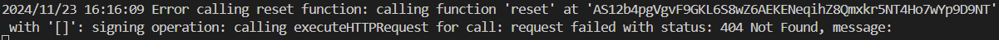

# 🎉 Counter DApp on the Massa Blockchain 🎉

This project is a simple decentralized application (DApp) that lets users interact with a smart contract managing a counter. 

The main goal of this project is to showcase the integration of a smart contract on the Massa blockchain using AssemblyScript and Massa SDK, while creating an intuitive React/TypeScript front-end and a Golang back-end service.

🔑 Key Features:

- Increment Counter: Increase the counter value from the frontend.
- Read Counter Value: Display the current counter value.
- Wallet Integration: Connect and display wallet info.
- Reset Counter: Reset the counter from the backend.


🚀 The Counter DApp is deployed on a [fleek](https://fleek.xyz/) domain. You can try it out directly [here](https://massa.on-fleek.app/) without any installation.

🌍 Ensure to have your `Bearby Wallet` installed and have some `Massa buildnet tokens` for seamless interaction!

✨ You can get them in the Discord `buildernet-faucet` channel:  
👉 [Join the Discord here](https://discord.com/channels/828270821042159636/1097797634065956915).

## ⚙️ Installation Guide

From the root of the project, simply run:

```shell
pnpm install
```
> **Note:** There's a workspace setup at the root, so this will install all dependencies for both backend and frontend simultaneously!

> **Note:** If you ever encounter an `@as-pect file missing error`, kindly install it in `backend` folder by running:

```shell
pnpm install -D @as-pect/assembly
```
## 🔨 Building the Backend

Navigate to the backend:

```shell
cd backend
```

Then, to build all files in the `assembly/contracts` directory, run: 

```shell
pnpm run build
```

## 🧪 Running Unit Tests

To test the smart contract, simply use:

```shell
pnpm run test
```

## 🚀 Deploying the Contract

1. Enter your PRIVATE_KEY in .env file in the backend folder

```shell
  PRIVATE_KEY=
```
🗝️ This key will be used by the deployer script to interact with the Massa blockchain.

✅ Ensure to use a Massa blockchain account whose private key starts with `S`.

👛 You can create an account on [Bearby](https://bearby.io/) or [Massa Wallet](https://station.massa.net/).

> **Note:** To connect to Counter on the frontend, you'll need to use Bearby, as Massa Wallet connection is not implemented yet.

2. To compile the contracts located in assembly/contracts and execute the deployment script src/deploy.ts:

```shell
pnpm run deploy
```
3. When deployment finishes, you’ll see the smart contract’s deployment address in the console. 

- Copy this address 
- Replace `CONTRACT_ADDRESS` with the deployed address in 

```shell
frontend/src/app/components/IncrementCounter.tsx
```

and `contractAddress` in

```shell
backend/go/server.go
```

4. To reset the counter, simply run the following command in the backend folder:

```shell
pnpm run reset
```

## 🖥️ User Interface 

To run the user interface, follow these steps:

1. Navigate to the frontend folder:

```shell
cd frontend
```
2. Start the Next.js server:

```shell
pnpm run dev
```

3. Access the app in your browser:

Go to: 

```shell
http://localhost:3000/
```
...or any other port displayed in your terminal.

💪 If you have the Bearby wallet installed, a Connect button will appear.


🎉 Once connected, enjoy the DApp! 


> **Note:** On your first connection, if the counter doesn't display correctly, just refresh the page! 

## 🤖 Server & Smart Contract Interactions with Go

To run the Go server to reset the counter, follow these steps:

1. Run `Massa Station` locally by following the documentation [here](https://docs.massa.net/docs/massaStation/install).

2. Navigate to the Go folder:

```shell
cd backend/go
```
3. To ensure that Go is installed on your computer, run:

```shell
go version
```

If not, follow the documentation on [Install GO](https://go.dev/doc/install).

4. Once Go is installed, run the following command to install dependencies:

```shell
go mod tidy
```

5. Start the server by running the following command:

```shell
go run server.go
```

6. Test the `reset` Endpoint:

- Using curl: You can send a POST request directly from your terminal::

```shell
curl -X POST http://localhost:8080/reset
```

- Using your browser: You can visit http://localhost:8080/reset in your browser.

This will trigger the smart contract's reset function on the Massa network.

Here is the error message that i have at this point : 



7. Test the `history` Endpoint:

- Using curl: You can send a POST request directly from your terminal::

```shell
curl -X POST http://localhost:8080/history
```

- Using your browser: You can visit http://localhost:8080/history in your browser.

This Should display the counter history.

> **Note:** This section is still under development 🔧💪

## 🌟 Improvements

🔒 Secure Secrets:

Never store your secrets and private keys in plain text on your hard disk. 
Use .env files and implement the Chainlink env-enc module to encrypt your secrets, or use any other encryption procedure. 🎥 Check out [Patrick Collins' video on the topic](https://www.youtube.com/watch?v=CIbhqRJ4B8I).

✅ More unit tests for better test coverage.

🧩 Improve modularity in Next.js code for better  maintainability.

💳 Massa Wallet Connexion Integration.

🌐 More interactions with the Go server.

🌱 Integrate updated Dependencies:

- Use massa-web3/tree/next 🌐
- Use wallet-provider/tree/next 💼

🎨 Adopt Tailwind for faster and more efficient styling!